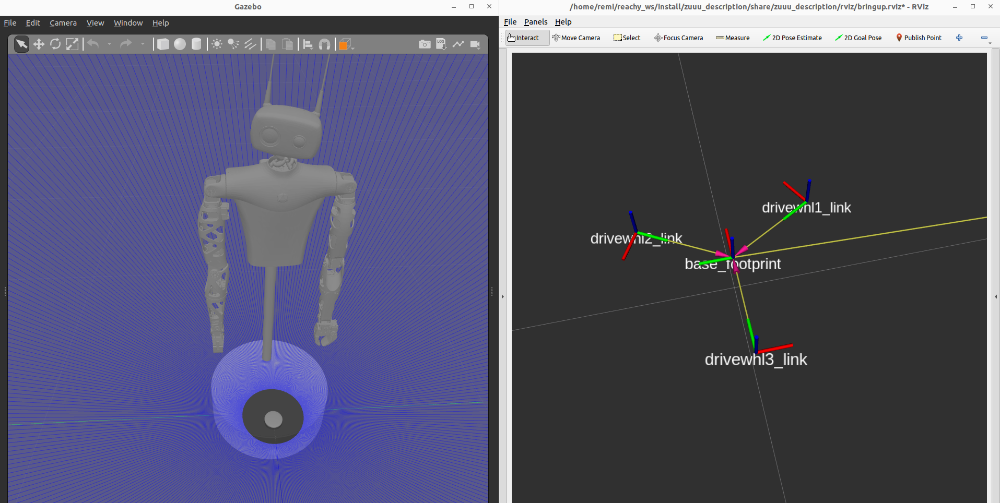

## Purpose
Mechanical description of the mobile base Zuuu.

## Usage
```
ros2 launch zuuu_description gazebo_simulation.launch.py
```
You should then be able to pilot the robot with:
```
ros2 run zuuu_hal teleop_keyboard
```


## TODOs (updated 19/10/2023)
- Add a mesh for the mobile base only, and not a monolith of the entire Reachy Mobile
- If useful bind ros controllers in velocity mode. I had something working under foxy, doesn't work anyomore, but afaik it's not useful so not porting it

## List of launch files and uses
Launch files starting with "zuuu" are intended to be used on the physical robot.
There are a lot of them for convenience but their content is pretty straightforward.

### description_bringup
Nodes: 
joint_state_broadcaster_spawner
robot_state_publisher_node
controller_manager_node

Default parameters for robot_description_content :
'use_gazebo:=false',
'use_fake_components:=false',
'use_fixed_wheels:=true',
'use_ros_control:=false',

### gazebo_simulation
Nodes: 
joint_state_broadcaster_spawner,
robot_state_publisher_node,
spawn_entity,
controller_manager_node,

Default parameters for robot_description_content :
'use_gazebo:=true',
'use_fake_components:=false',
'use_fixed_wheels:=true',
'use_ros_control:=true',


### rviz_bringup
Nodes:
rviz2

### zuuu_bringup
Nodes:
Rviz

Launches:
zuuu_rplidar_s2_launch
description_bringup
hal_launch

### zuuu_bringup_low_level_only
Launches:
zuuu_rplidar_s2_launch
hal_launch

### zuuu_bringup_no_rviz
Launches:
zuuu_rplidar_s2_launch
description_bringup
hal_launch

